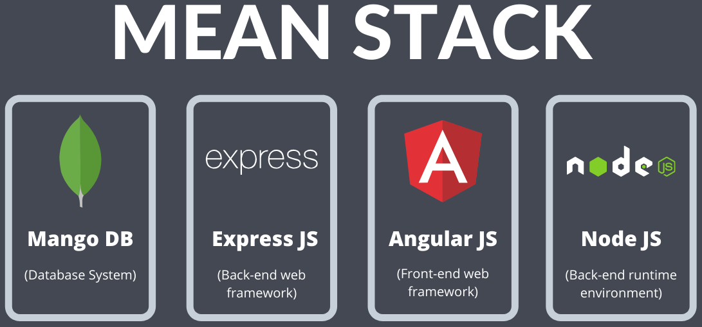

# MiWebApp

Hola, esta es mi Single Page Application (SPA) donde podrás evidenciar todo lo aprendido en el BOOTCAMP(Desarrollo Web Full Stack).

## 🚀 Demo
Aquí puedes ver la demo de la SPA: [IR](https://luisolascoagadiaz.github.io/bit-frontend)

## Tecnologías usadas

## Características
* Front-End.
* Back-End.
* Database.
* API.

## Autor:
LUIS OLASCOAGA DIAZ

> [!TIP]
> Sigue mi progreso en :octocat: [@luisolascoagadiaz](https://www.github.com/luisolascoagadiaz).

Date: 17/07/2025 06:00 p.m  
Madrid, Cundinamarca, Colombia.
